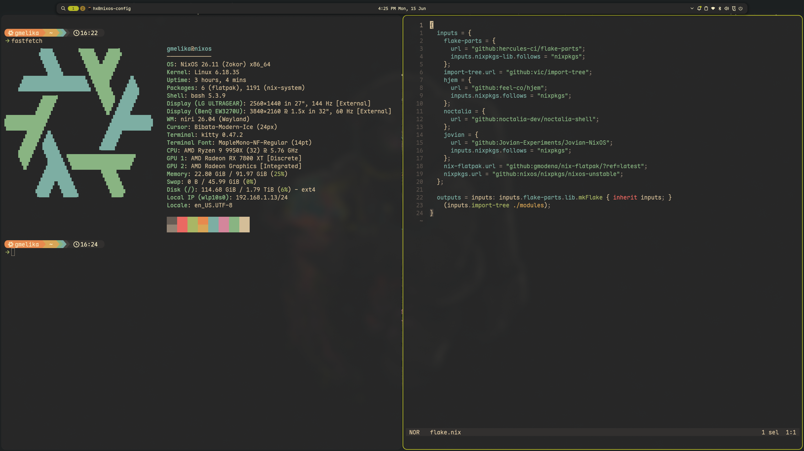

# NixOS Configuration

Personal NixOS configuration built with flakes. Manages multiple hosts for development and entertainment.

## Screenshots

## Hosts

| Host | Purpose |
|------|---------|
| **Workstation** | Rust development, Android development |
| **ThinkPad X13 Yoga** | Lightweight travel machine, Rust projects |
| **Living HTPC** | Jovian NixOS (SteamOS), Kodi |
| **Steam Deck** | Work in progress |

## Stack

- **Window manager:** niri
- **Shell:** noctalia v5
- **Color scheme:** gruvbox (shell), gruvbox-material (terminal apps)
- **Dotfile management:** hjem (plain dotfiles, no home-manager)
- **Module structure:** dendritic pattern via import-tree

## Disclaimer

Do not run this as-is. Review the code thoroughly and adapt it to your needs before applying anything.

## Credits

- [Dendritic pattern](https://github.com/mightyiam/dendritic/tree/master)
- [@eduardofuncao nali](https://github.com/eduardofuncao/nali)
